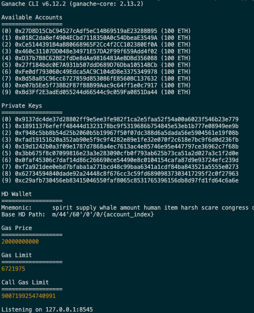
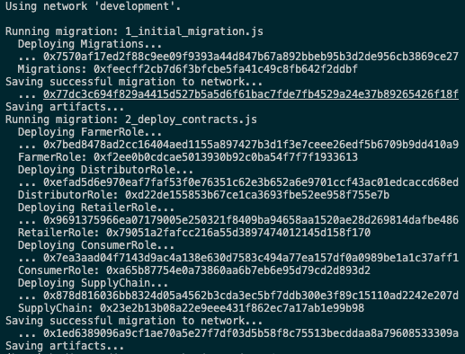
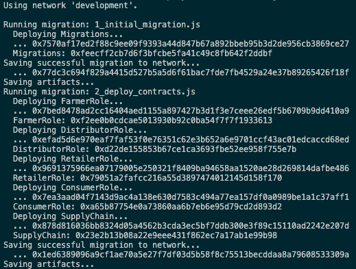
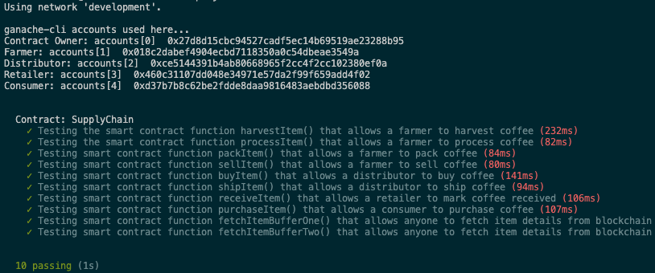

# A Supply Chain DApp & Product Authenticity Tracking

**Table of Contents**

- [About this Supply Chain DApp](#about-this-supply-chain-dapp)
  - [DApp Introduction](#dapp-introduction)
  - [Published DApp Info to IPFS](#published-dapp-info-to-ipfs)
  - [UML Diagrams](#uml-diagrams)
  - [Contract Deployed on the Sepolia Test Network](#contract-deployed-on-the-sepolia-test-network)
- [Requirements and Setup](#requirements-and-setup)
  - [Required Technologies & Libraries](#required-technologies-libraries)
  - [Deployment Instructions](#deployment-instructions)
  - [Additional Setup](#additional-setup)
    - [1. Metamask configuration: Import these accounts into Metamask](#1-metamask-configuration-import-these-accounts-into-metamask)
    - [2. Assign the accounts the specific Roles accordingly](#2-assign-the-accounts-the-specific-roles-accordingly)

<!-- TOC end -->

<!-- TOC --><a name="about-this-supply-chain-dapp"></a>

## About this Supply Chain DApp

<!-- TOC --><a name="dapp-introduction"></a>

### DApp Introduction

This repository containts an Ethereum DApp that demonstrates a Supply Chain flow between a Seller and Buyer. The user story is similar to any commonly used supply chain process. A Seller can add items to the inventory system stored in the blockchain. A Buyer can purchase such items from the inventory system. Additionally a Seller can mark an item as Shipped, and similarly a Buyer can mark an item as Received.

This DApp implements a Coffee Supply Chain and enables you to track the coffee beans authenticity from the farmer, distributor, retailer, to the consumer.

<!-- TOC --><a name="published-dapp-info-to-ipfs"></a>

### Published DApp Info to IPFS

The DApp was published to the IPFS to make it more decentralized. IPNS was used to make sure we can easily update our website and publish to the same IPNS hash:

```
https://ipfs.io/ipns/k51qzi5uqu5dgna0gl4za826go0m7npvqykuye4j7uat96bk84r45h66pc3ulu
```


<!-- TOC --><a name="uml-diagrams"></a>

### UML Diagrams

- Activity Diagram

  

- Sequence Diagram

  

- State Diagram

  

- Data Modeling Diagram

  

<!-- TOC --><a name="contract-deployed-on-the-sepolia-test-network"></a>

### Contract Deployed on the Sepolia Test Network

Contract Address and Link:

```
0x9a16381f14Eba07f284589d74cF92c1a02877B59
https://sepolia.etherscan.io/address/0x9a16381f14Eba07f284589d74cF92c1a02877B59
```

Deployment Transaction Hash and Link:

```
0xbc0dbf3e7c2132b621428a907df6b4a2c854e94bf790e962ce915cf494778100
https://sepolia.etherscan.io/tx/0xbc0dbf3e7c2132b621428a907df6b4a2c854e94bf790e962ce915cf494778100
```

<!-- TOC --><a name="requirements-and-setup"></a>

## Requirements and Setup

<!-- TOC --><a name="required-technologies-libraries"></a>

### Required Technologies & Libraries

```
Node v14.9.0
web3 0.20.6
Truffle v4.1.14
Solidity v0.4.24
Truffle-hdwallet-provider 1.0.17
ganache-cli
Metamask
```

<!-- TOC --><a name="deployment-instructions"></a>

### Deployment Instructions

- Change directory to `project-6` folder and install all requisite npm packages:

```
cd project-6
npm install
```

- Launch Ganache:

```
ganache-cli -m "spirit supply whale amount human item harsh scare congress discover talent hamster"
```

Your terminal should look something like this:



- In a separate terminal window, Compile smart contracts:

```
truffle compile
```

Your terminal should look something like this:



This will create the smart contract artifacts in folder `build\contracts`.

- Migrate smart contracts to the locally running blockchain, ganache-cli:

```
truffle migrate
```

Your terminal should look something like this:



Alternatively, use this command to deploy to Sepolia using truffle

```
truffle migrate --reset --network sepolia
```

- Test the smart contracts:

```
truffle test
```

All 10 tests should pass.



- In a separate terminal window, launch the DApp:

```
npm run dev
```

<!-- TOC --><a name="additional-setup"></a>

### Additional Setup

<!-- TOC --><a name="1-metamask-configuration-import-these-accounts-into-metamask"></a>

#### 1. Metamask configuration: Import these accounts into Metamask

1. 0x018c2dabef4904ecbd7118350a0c54dbeae3549a => Farmer's Account

2. 0xce5144391b4ab80668965f2cc4f2cc102380ef0a => Distributor's Account

3. 0x460c31107dd048e34971e57da2f99f659add4f02 => Retailer's Account

4. 0xd37b7b8c62be2fdde8daa9816483aebdbd356088 => Consumer's Account

<!-- TOC --><a name="2-assign-the-accounts-the-specific-roles-accordingly"></a>

#### 2. Assign the accounts the specific Roles accordingly

The accounts used to test this need to be set up outside of the code. Ideally, we would create an interface to enable this feature.

Launch `truffle console` and run the commands below

```
web3.eth.getAccounts(function(err,res) { accounts = res; });
farmerID = accounts[1]
distributorID = accounts[2]
retailerID = accounts[3]
consumerID = accounts[4]

SupplyChain.deployed().then( function(instance) { return instance.addFarmer( farmerID ) })
SupplyChain.deployed().then( function(instance) { return instance.addDistributor( distributorID ) })
SupplyChain.deployed().then( function(instance) { return instance.addRetailer( retailerID ) })
SupplyChain.deployed().then( function(instance) { return instance.addConsumer( consumerID ) })
```
